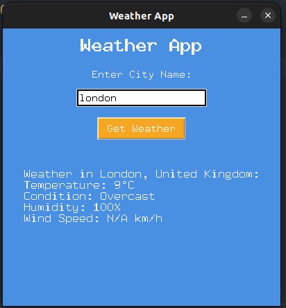

# Weather App with Tkinter and Weatherstack API

This is a simple weather application built using Python's Tkinter library to create a GUI and the Weatherstack API to fetch real-time weather information for a given city. 

## Features
- Enter any city name to get the weather details.
- Displays temperature, weather condition, humidity, and wind speed.
- Sleek, colorful user interface using Tkinter.

## Installation

1. Clone this repository to your local machine:
  ```bash
   git clone https://github.com/cnaser1990/weather-app
   ```
2. Navigate to the project directory:
  ```bash
   cd weather-app
  ```
3. Create and activate a virtual environment:
  ```bash
   python -m venv venv
   source venv/bin/activate  # On Windows use: venv\Scripts\activate
  ```
4. Install the necessary dependencies:
  ```bash
  pip install -r requirements.txt
  ```
5. Run the application:
  ```bash
  python app.py
  ```

### Screenshots


